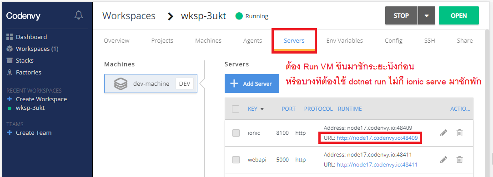

# Ionic

## สร้าง Ionic project
```
ionic start demoionic
```
> **demoionic** คือชื่อโปรเจคและจะได้ folder ชื่อนั้นด้วย *(ไม่เปลี่ยนก็แล้วแต่ - เตือนแล้วนะ)*

## การเข้า Ionic
```
ionic serve
```
> ต้องอยู่ใน folder ionic project แล้ว  

 
   

## เพิ่มหน้าใหม่
```
ionic g page YOUR_PAGENAME_HERE
```
> ต้องอยู่ใน folder ionic project แล้ว  

**src/app/app.module.ts**
```
import { YOUR_PAGENAME_HERE } from '../pages/YOUR_PAGENAME_HERE/YOUR_PAGENAME_HERE';

declarations: [
    YOUR_PAGENAME_HERE
]

entryComponents: [
    YOUR_PAGENAME_HERE
]
```

## การเปลี่ยนหน้า
**หน้าที่จะเรียกใช้**
```
import { NavController } from 'ionic-angular';

constructor(public navCtrl: NavController){
}
```
ตัวอย่าง - เปลี่ยนหน้าปรกติ
```
this.navCtrl.push(ENTER_PAGE_NAME_HERE);
```
ตัวอย่าง - เปลี่ยนหน้าโดยส่งข้อมูลไปด้วย (parameter)
```
this.navCtrl.push(ENTER_PAGE_NAME_HERE, 
{
      PROPERTY_NAME_1: VALUE_1,
      PROPERTY_NAME_2: VALUE_2
});
```

## การรับข้อมูลจากหน้าอื่นผ่าน parameter
**หน้าที่จะเรียกใช้**
```
import { NavParams } from 'ionic-angular';

constructor(public navParams: NavParams){
}
```
ตัวอย่าง
```
constructor(public navParams: NavParams){
    var VARIABLE_NAME_1 = navParams.get('PROPERTY_NAME_1');
    var VARIABLE_NAME_2 = navParams.get('PROPERTY_NAME_2');
}
```

## การเรียกใช้ HttpClient
**src/app/app.module.ts**
```
import { HttpClientModule } from '@angular/common/http'

imports: [
    HttpClientModule
]
```
**หน้าที่จะเรียกใช้**
```
import { HttpClient } from '@angular/common/http';

constructor(public http: HttpClient) {
}
```
ตัวอย่าง - GET
```
this.http.get<YOUR_MODEL_NAME_HERE>("ENTER_YOUR_API_HERE").subscribe(
    it => {
        // SUCCESS: Do something
    }, 
    error => {
        // ERROR: Do something
    });
```
ตัวอย่าง - POST
```
this.http.post<YOUR_MODEL_NAME>("ENTER_YOUR_API_HERE",
    {
        PROPERTY_NAME_1: VALUE_1,
        PROPERTY_NAME_2: VALUE_2
    }).subscribe(
        it => {
        // SUCCESS: Do something
        }, 
        error => {
            // ERROR: Do something
        });
```
ตัวอย่าง - PUT
```
this.http.put<YOUR_MODEL_NAME>("ENTER_YOUR_API_HERE",
    {
        PROPERTY_NAME_1: VALUE_1,
        PROPERTY_NAME_2: VALUE_2
    }).subscribe(
        it => {
            // SUCCESS: Do something
        }, 
        error => {
            // ERROR: Do something
        });
```
ตัวอย่าง - DELETE
```
this.http.delete<YOUR_MODEL_NAME>("ENTER_YOUR_API_HERE").subscribe(
    it => {
        // SUCCESS: Do something
    }, error => {
        // ERROR: Do something
    });

```

## Google's QR
```
https://chart.googleapis.com/chart?cht=qr&chs=250x250&chl=YOUR_TEXT_HERE
```
> chs: ขนาดรูป 250 x 250 (เปลี่ยนเอา)  
> chl: ข้อความที่จะส่งไปสร้างเป็น QR  


